## Using IBM DataPower Gateway v7.5 to enforce Kerberos Security

https://github.com/ibm-datapower/datapower-tutorials/tree/master/datapower-enforce-kerberos

The IBM DataPower Gateway is widely used in the industry to protect backend resources from unauthorized accesses, enforcing enterprise security policies and, at the same time, offloading the backend servers from all security-related activities.
The article shows how to configure IBM DataPower Gateway in order to protect a HTTP resource enforcing Kerberos security.
In the proposed scenario, the DataPower appliance will allow a HTTP client to invoke a HTTP service only if the HTTP request will carry a valid SPNEGO token.
To test the correct behaviour of the system a SmartBear SoapUI will be used on a Client machine.

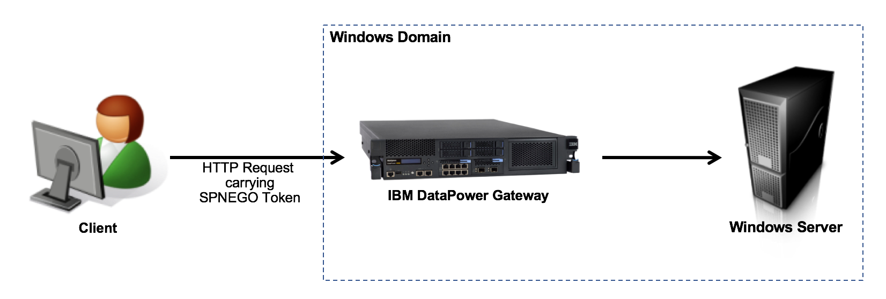


### Domain Name Server configuration

As a preliminary step, we have to configure at least two entries in the Domain DNS, one for the Windows Server machine, the other for the DataPower Gateway.
Using the server manager, access the DNS manager:

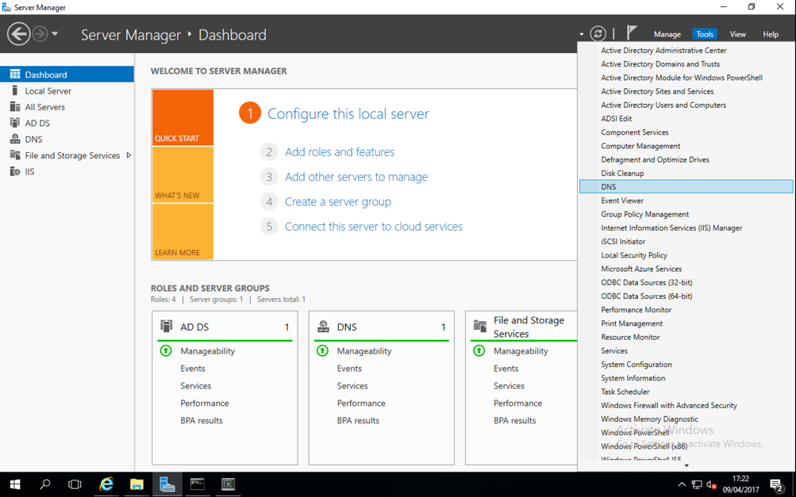

Select **Action**->**New Host (A or AAAA)** and create an entry for DataPower Gateway:


The same for the Windows Server machine (`winserver`), so that the DNS list will appear as follows:

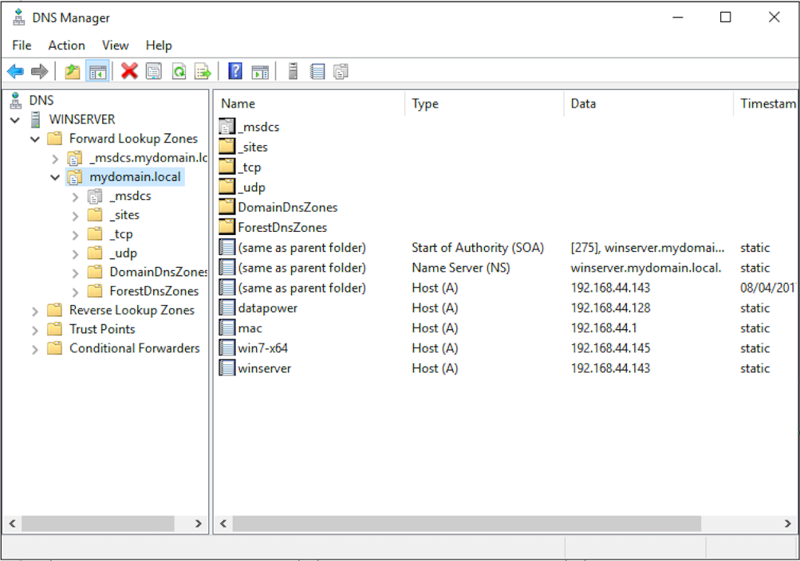


### Active Directory Configuration

In this section are described the configuration steps to be executed on Microsoft Active Directory in order to define a new *pseudo* User ID. In the next section, the newly created user ID will be associated with a new Service Principal Name that will uniquely identify our DataPower service.

1. In the Server Manager, select **Tools**->**Active Directory Users and Computers**:

   

2. Create a new user, let say `dp`:

   

3. Fill required fields as shown below and click **Next**:

   

4. Set a password (let say `Passw0rd!`), and modify the check boxes status so that the user might NOT change the password at the next logon and the password never expires, as shown below. Click **Next** and then **Finish** to complete the wizard.

   

Right-click the newly created user from the list of all available users and select **Properties**, then enter the **Account** tab:


In the **Account options** only four options are to be checked: the first is **Password never expires** (as set before); the others are at the bottom of the list, as shown below:


These settings give maximum flexibility about the encryption algorithm the account can use. This means that Kerberos ticket that will be exchanged between the client and the DataPower service (i.e. the `dp` user we have just created) can be encrypted using a wide range of algorithms, giving maximum interoperability.


### Defining the Service Principal Name (SPN) for DataPower service

This section shows how to create a new Service Principal Name (SPN) for DataPower services and how to associate them with the `dp` user created in the previous section.
The SPN creation is made via command line (DOS prompt), using the `setspn` command.

First, verify that the user `dp` does not have associated any SPN.
Run the command:

```
setspn -l dp
```

The output must be empty: no SPN registered for `dp` user:


Now, create the new SPN and associate it to `dp` user:

```
setspn -a HTTP/datapower.mydomain.local dp
```

Run again the following:

```
setspn -l dp
```

and verify that the SPN has been associated correctly:


Using again the Active Directory user interface, entering in the properties of `dp` user, account tab, you should see the **User logon name** changed accordingly to the `HTTP/datapower.mydomain.local`:

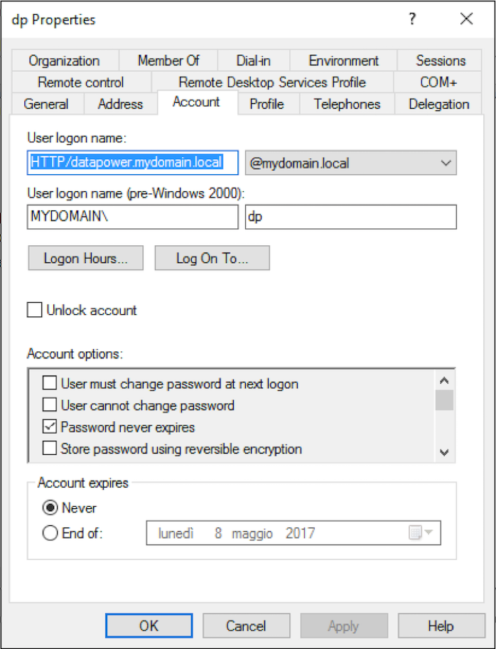


### Generating the Kerberos Keytab file to be imported in DataPower Gateway

This section show how to generate the *keytab* file, i.e. the artifact to import in the DataPower AAA action, in order to decrypt, parse and validate the Kerberos ticket sent by the client.
The keytab file is generated via command line (DOS prompt), using the `ktpass` command.
Using the `-?` flag, the command will show an online help:

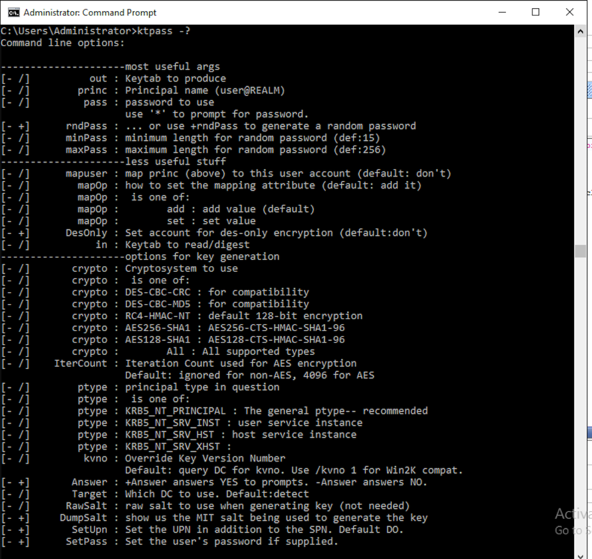

In our scenario, we'll pass following parameters:

* *out*: the name of the keytab file fo produce
* *princ*: the principal name that we have create before, in the form `SPN@REALM` - in our case, the SPN is `HTTP/datapower.mydomain.local` and the realm is `MYDOMAIN.LOCAL`
* *mapUser*: the active directory username we associated to the SPN, i.e. `dp`
* *mapOp*: the action to perform to set the mapping attribute, in our case is `set` (the alternative is `add`)
* *+rndPass*: to force the command to generate a random password
* *crypto*: the crypto system to use generating the keymap; in our case we’ll specify `All` to give maximum interoperability to the client
* *ptype*: the type of the principal we are going to create, in our case we’ll specify `KRB5_NT_PRINCIPAL` to intend a a general principal

```
ktpass -out pocAllCrypto.keytab -princ HTTP/datapower.mydomain.local@MYDOMAIN.LOCAL -mapUser dp -mapOp set +rndpass -crypto All -ptype KRB5_NT_PRINCIPAL
```

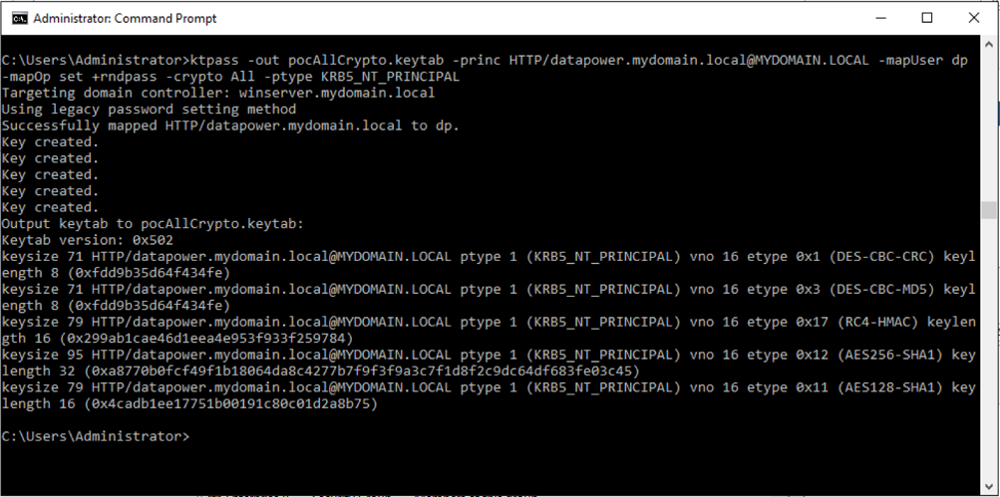

Assure that the command discovers automatically the target domain controller, in out case is `winserver.mydomain.local`, and that the SPN is successfully mapped to our `dp` user.
As you see, all keys will be created, one per crypto algorithm supported.
The file `pocAllCrypto.keytab` is now created and ready to be imported in the DataPower AAA action.


### Creating a Multiprotocol Gateway on DataPower

In this section, we’ll create a new Multiprotocol Gateway on DataPower in order to protect a public Internet resource. For simplicity, let that resource the public IBM home page at `http://www.ibm.com`.

IMPORTANT: As preliminary step, verify that the DataPower clock is in synch with the Domain Controller clock (i.e. the Windows Server machine). The clock difference must be less than few seconds or, better, the two clocks should be in synch with a common NTP server.

Create a new Multiprotocol Gateway called `KerberosMPG` as described below:


Set as `Default Backend URL` an available resource, e.g. http://www.ibm.com
Set as `Request Type` and `Response Type` the `Non-XML` option, because the resource set before in an HTML page.
Add an `HTTP Handler` preferably listening on port 80, enabling the `GET` method, and leaving all other fields at the default value:

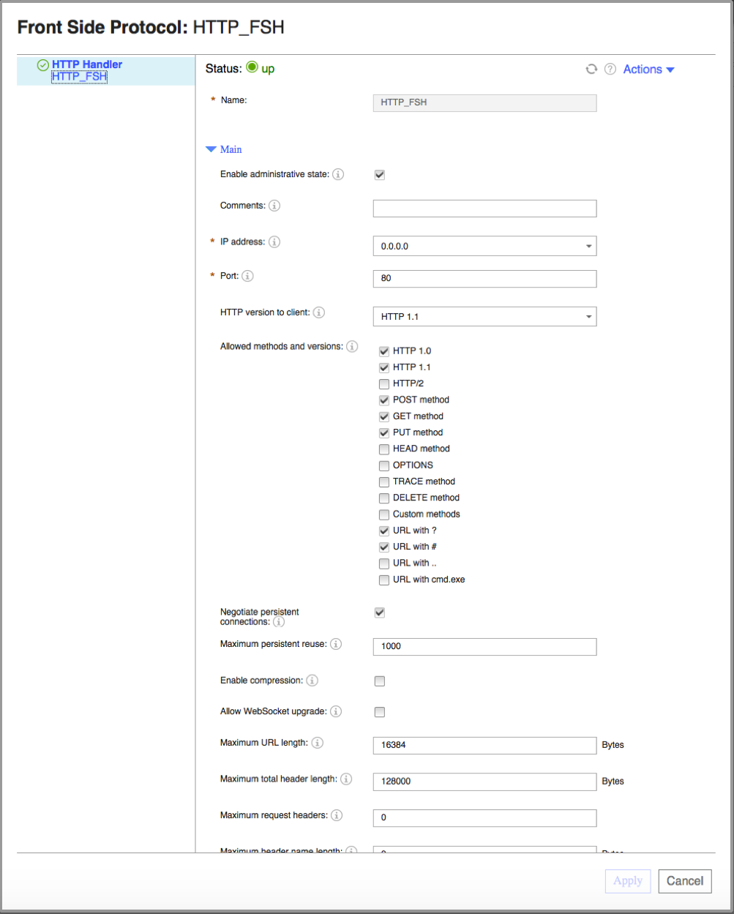

Create a new processing policy called `KerberosPolicy`, having two processing rule, the first with the direction Client to Server, the second from Server to Client.
Configure the first rule, as follows:
* a Match action matching all incoming requests (e.g. setting a rule matching all URLs)
* a AAA action
* a Return action

and the second rule having:
* a Match action matching all incoming requests (e.g. setting a rule matching all URLs)
* a Return action


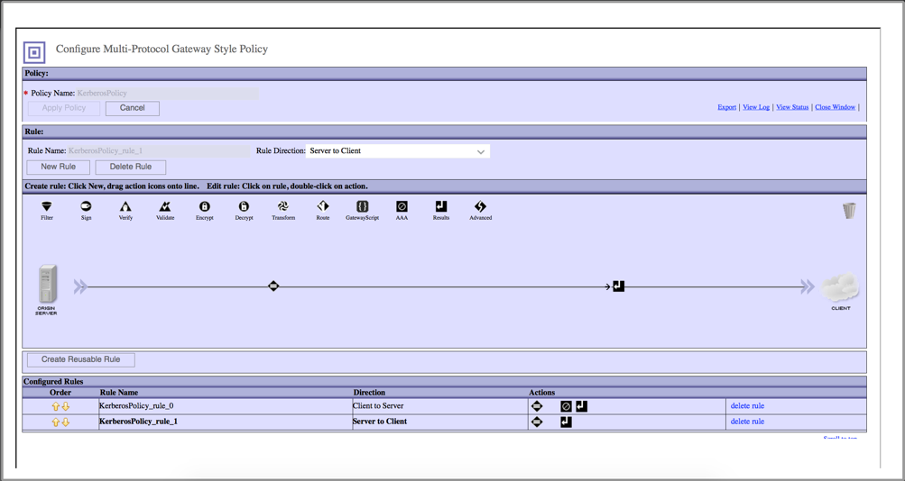

The authentication policy is governed by the AAA action, let it `KerberosAAA`.
The action is configured as follows.

1. **Identification Method**: must be set to `Kerberos AP-REQ from SPNEGO token`:

   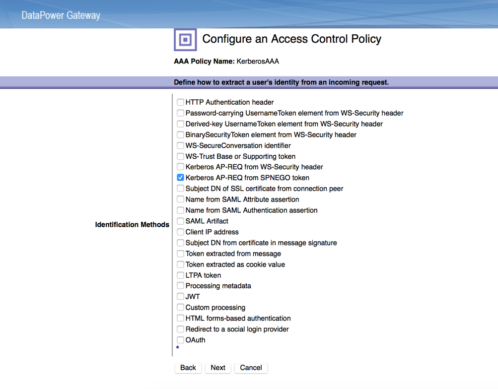

1. **Authentication Method**: must be set to `Validate Kerberos AP-REQ for server principal`:

   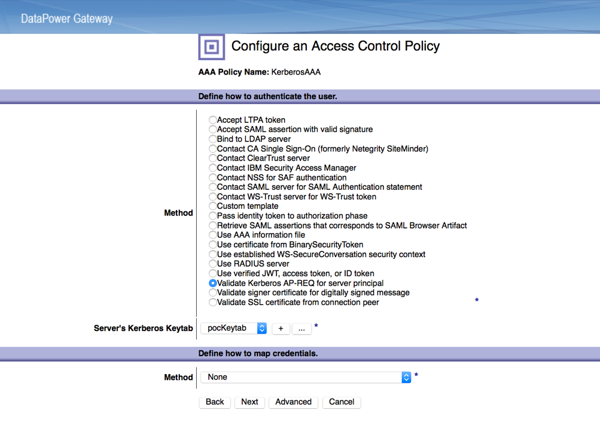

   When you check this option, the user interface gives you the possibility to create a keytab object: click on `+` (plus) symbol to create the new keytab object; let it `pocKeytab`.
   Click the `Upload` button to upload the `pocAllCrypto.keytab` file created before.
   To do a more deterministic test and a more easy problem determination in case of problems, leave the `Use Replay Cache` option unchecked. Conversely, for production use, is recommended to check the option for performance reason.

   Click on `Apply` to confirm the creation of the new object.

   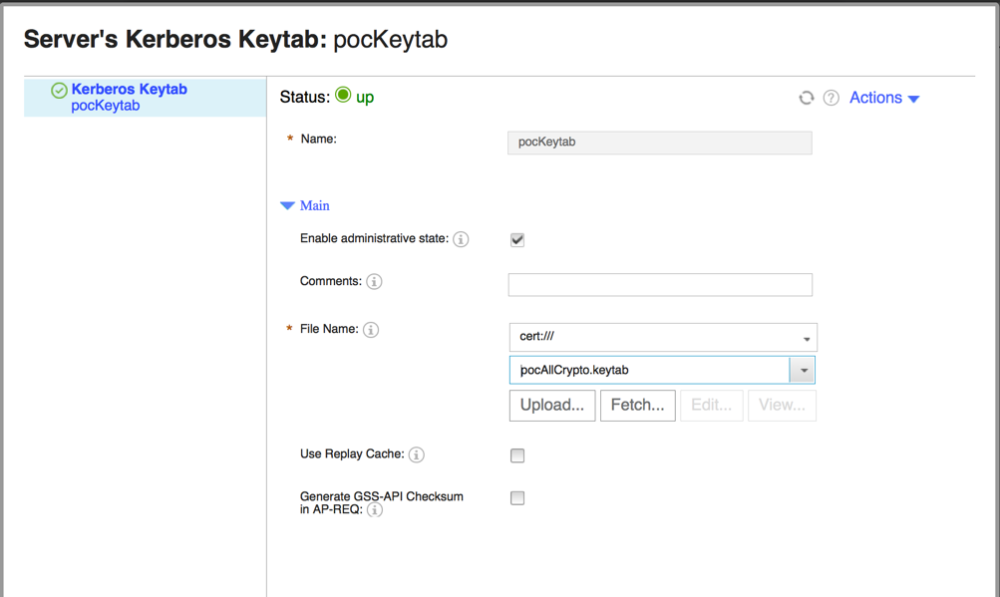

   Let continue to configuration of the AAA action.

1. **Resource Identification Method**: select `URL sent by Client` option:

   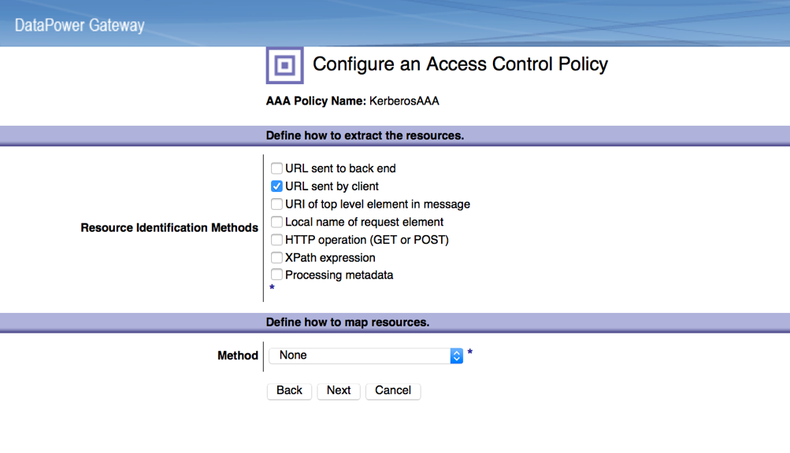

1. **Authorization method**: select `Allow any authenticated client`:

   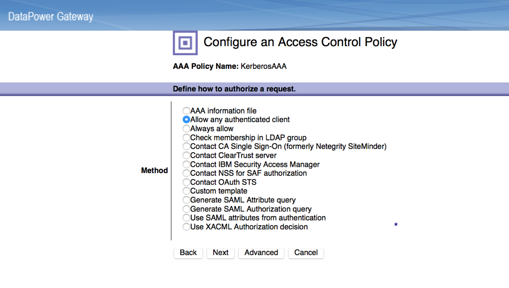

1. **Post-processing**: leave all unchanged, and click `Commit`.

   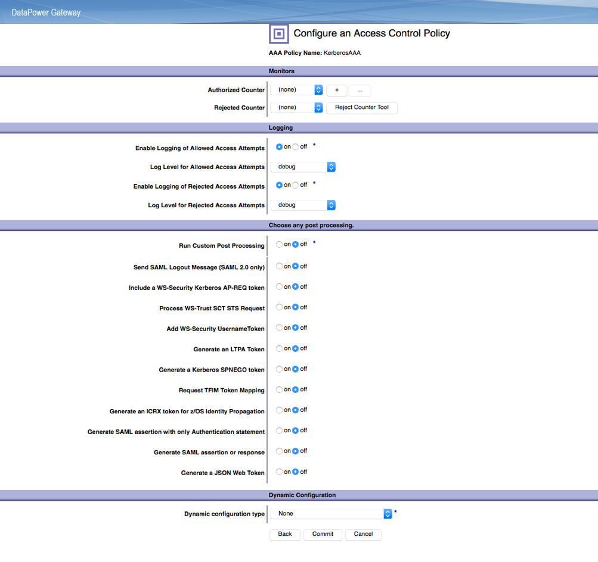

Apply all the configurations and ensure that the Multiprotocol gateway is in state `Up`.


### Using an HTTP client to test the configuration

In this section we’ll use a general purpose HTTP client to test the DataPower configuration, verifying that only requests having a valid SPNEGO token (carrying a valid Kerberos ticket) are served.
As an example, we can use the open source version of SoapUI client from SmartBear (https://www.soapui.org), because supports by default the creation of SPNEGO token.

Since the client must be able to produce Kerberos/SPNEGO artifacts, it must run on a Windows Machine, logged in the Windows domain.

As first test, we’ll use our client to verify that a “plain” request not carrying an SPNEGO token is rejected by the DataPower.
Create a new SoapUI project, with a GET HTTP request, as show below, and try to send a GET request to the URL http://datapower.mydomain.local.


The request is rejected by the DataPower, as you can see in the right canvas of SoapUI, with the message `Rejected by policy`.
More in detail, let examine the logs: the client sent a GET / request; since the target service is protected using Kerberos/SPNEGO authentication, the DataPower responds with HTTP 401 Unauthorized, and presenting to the client the SPNEGO authentication challenge: `WWW-Authenticate: Negotiate`. Notice that this a SPNEGO specific challenge, that must not be confused with the NTLM challenge, also used in a Windows Domain under certain other conditions.
In this test, SoapUI has not been configured to respond to the challenge and the request/response transaction terminates without other exchanges.

Let we configure SoapUI to respond to the `Negotiate` challenge.
The configuration is quite long, but is well explained at the following link: https://www.soapui.org/soap-and-wsdl/spnego/kerberos-authentication.html
As explained in the SoapUI documentation, we need to complete following configuration steps:
1. modify a Windows Registry key in order to allows the SoapUI JVM to access the Ticket-Granting Ticket (TGT) session key
1. create a keytab (`Administrator.keytab`) containing the user password to be used
1. create a configuration file (`krb5.conf`) containing information about the Key Distribution Center (KDC) that will be used by SoapUI to retrieve the service ticket
1. create a configuration file (`login.conf`) to be used by SoapUI JAAS Login Module
1. modify the SoapUI JVM options to access the files created before
1. request a TGT and save it to a cache file, to be accessed later by SoapUI, and used to retrieve the final service ticket

Create a folder called `c:\kerberos` to store the files created in steps 2, 3, 4.

**Step 1 - Modify the Windows Registry**
Refer to the SoapUI documentation, at the link specified above.

**Step 2 - Crete a keytab containing the user password**
Open a DOS prompt, enter the `<SoapUI_Install_Dir>/jre/bin` directory and launch the following command:

```
ktab -a Administrator Passw0rd! -k C:\kerberos\Administrator.keytab
```

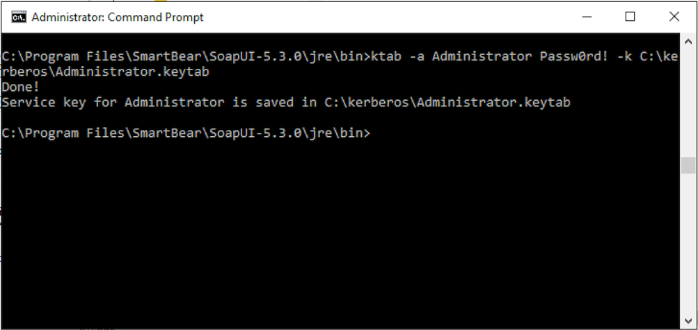

Assure that the file `Administrator.keytab` has been created in the `C:\kerberos` folder.

**Step 3 - Create the configuration file krb5.conf containing information of the KDC**
In the same `C:\kerberos` folder, create the `krb5.conf` file containing the following:

```
[libdefaults]
	default_realm = MYDOMAIN.LOCAL
	udp_preference_limit = 1
[realms]
	MYDOMAIN.LOCAL = {
		kdc = winserver.mydomain.local
		default_domain = MYDOMAIN.LOCAL
}
[domain_realms]
	.mydomain.local=MYDOMAIN.LOCAL
```

**Step 4 - Create the configuration file login.conf for the JVM JAAS Login Module**
In the same `C:\kerberos` folder, create the `login.conf` file containing the following:

```
com.sun.security.jgss.login {
  com.sun.security.auth.module.Krb5LoginModule
  required
  client=TRUE;
};
com.sun.security.jgss.initiate {
  com.sun.security.auth.module.Krb5LoginModule
  required
  debug=true
  useTicketCache=true
  useKeyTab=true
  keyTab="file:///C:/kerberos/Administrator.keytab"
  principal="Administrator@MYDOMAIN.LOCAL"
  doNotPrompt=true;
};
com.sun.security.jgss.accept {
  com.sun.security.auth.module.Krb5LoginModule required client=TRUE useTicketCache=true;
};
```

**Step 5 - Modify the SoapUI JVM options to use the new configuration files**
Refer to the SoapUI documentation to complete this steps.

As a result, the file `<SoapUI_Install_Dir>/bin/SoapUI.xxx.vmoptions` must contain the following three lines:

```
...
-Djavax.security.auth.useSubjectCredsOnly=false
-Djava.security.auth.login.config=C:/kerberos/login.conf
-Djava.security.krb5.conf=C:/kerberos/krb5.conf
...
```

**Step 6 - Request a TGT ticked and save it to a cache file**
Using a DOS prompt, enter the `<SoapUI_Install_Dir>/jre/bin` directory start the following interactive command and, when requested, enter the Administrator password (or the password for the user that is logged on the Windows domain):

```
kinit
```


Assure that the file `krb5cc_Administrator` is created in the Administrator’s home folder.

IMPORTANT: The TGT stored in the cache file expires after a while. Using the command `klist` you can see the when the ticket has been issued and when it will expire:

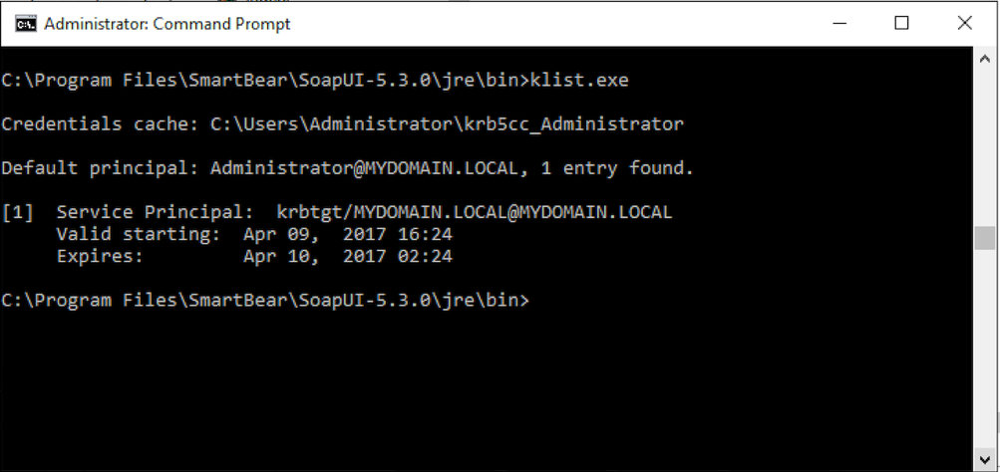

If the TGT is expired, simply regenerate it running the command kinit again.

Restart the SoapUI.

Retry to send the GET HTTP request to the target http://datapower.mydomain.local: the request sill be server by DataPower.

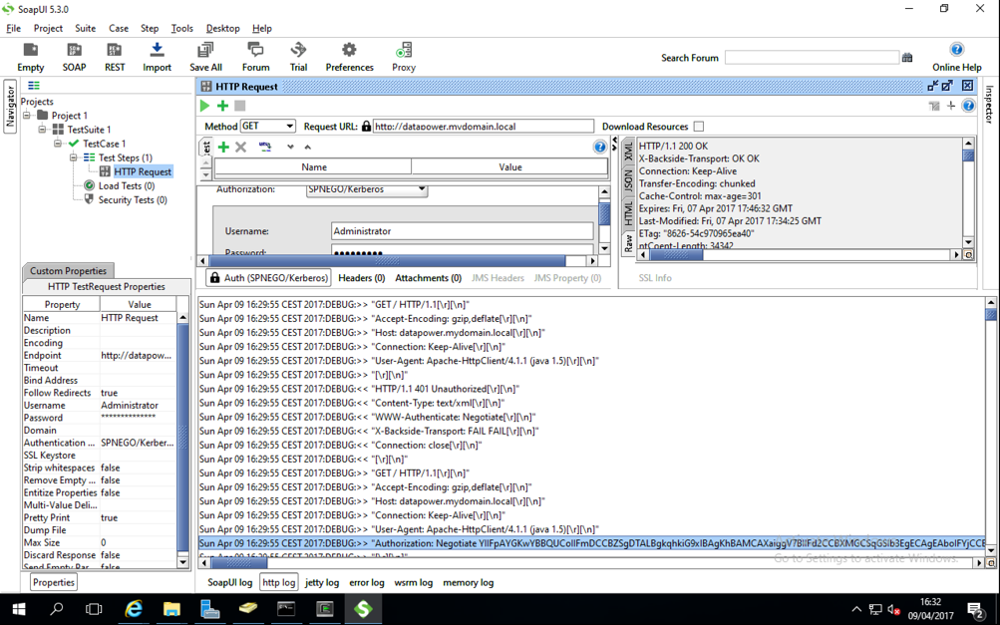

More in detail, let examine the http logs produced by SoapUI: the first request sent by the client is not carrying any security token, and the response from DataPower is a HTTP 401 Unauthorized, with the SPNEGO challenge `www-Authenticate: Negotiate`.
This this, the SoapUI generates the SPNEGO token using the parameters we provided in the files created before, and try a second request attaching the `Authorization: Negotiate .....` header, i.e. attaching the just generated SPNEGO token.
The DataPower is now able to acquire the SPNEGO token, decrypt it using one of supported decryption algorithm and the corresponding key that we put in his keytab file, extract the Kerberos ticket, validate it, and proceed proxying the request to the target backend.
We can see the full history using the DataPower logs.

The first request generates following logs:

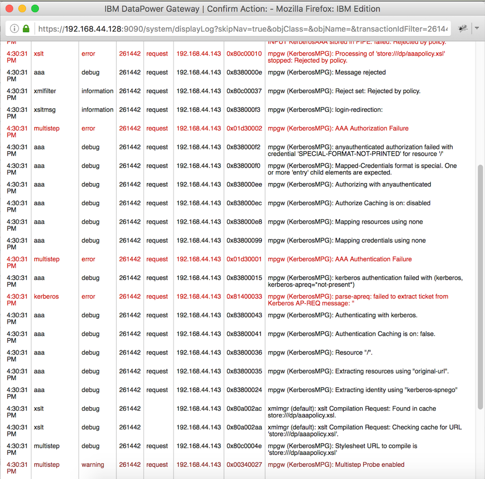

Reading bottom-up (as usual), the AAA action activates but fails with the message `failed to extract ticket from Kerberos AP-REQ message`. Then `kerberos authentication failed with (kerberos, kerberos-apreq=*not-present*)`. In fact, in the first request there is no SPNEGO token in the request.

The second request, conversely, produces following logs:

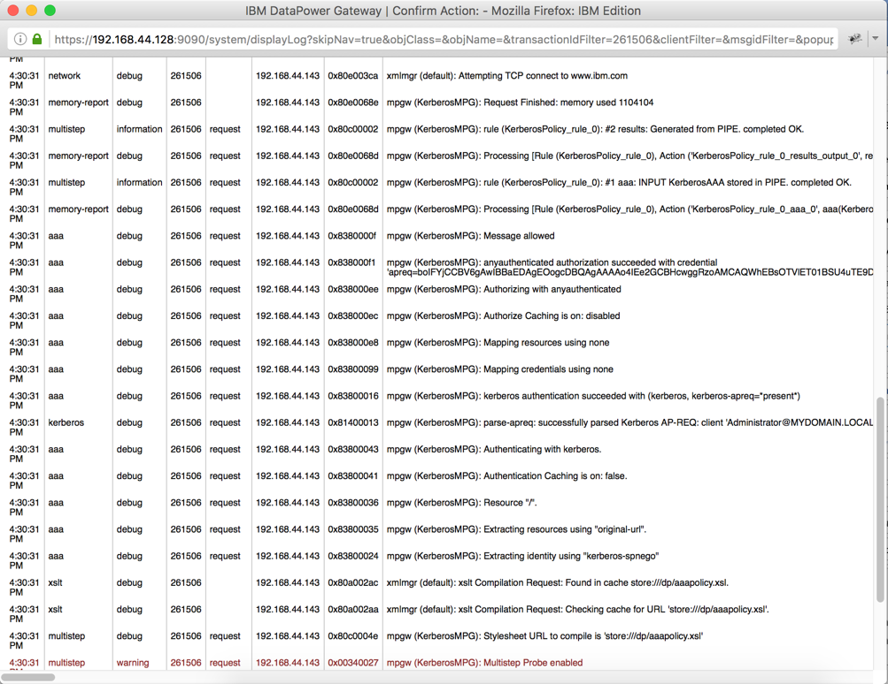

After AAA action activation, the log says  `parse-apreq: successfully parsed Kerberos AP-REQ: client 'Administrator@MYDOMAIN.LOCAL...` and then kerberos authentication succeded.


### Troubleshooting Tips

If you have trouble, pls take a look to following links, explaining common causes:

* Kerberos Token version:
`http://www-01.ibm.com/support/docview.wss?uid=swg21502341`

* FIPS Mode enabled on DataPower Gateway:
`https://www.ibm.com/support/knowledgecenter/en/SS9H2Y_7.5.0/com.ibm.dp.doc/nist_cryptomodeoverview.html`
